# Flonp · Mobile

> Flonp é um projeto desenvolvido para um trabalho de conclusão de curso de Análise e Desenvolvimento de Sistemas. 
E está publicado nesse repositório com o intuíto de expor meu portifólio e contribuir com ideias para a comunidade.

 

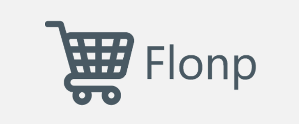

  <a href="#-sobre-o-tcc">Sobre o TCC</a> |
  <a href="#%EF%B8%8F-arquitetura">Arquitetura</a> |
  <a href="#-tecnologias">Tecnologias</a> |
  <a href="#-capturas-de-telas">Capturas de Telas</a>

## 📝 Sobre o TCC

**Resumo:** Este trabalho apresenta o desenvolvimento de um sistema para
auxiliar no relacionamento entre supermercados e seus compradores. O
objetivo principal é facilitar a divulgação de produtos e promoções oferecidas
por supermercados, assim como auxiliar os consumidores a encontrarem essas
informações em um local unificado. O sistema é composto por duas partes:
uma aplicação web, para atender os supermercados na configuração de
produtos, acompanhado de um aplicativo mobile possibilitando que os
compradores possam realizar as consultas de produtos dos supermercados
desejados. As principais tecnologias utilizadas foram os frameworks React,
React Native e o .Net Core para a criação de uma API que alimenta as duas
aplicações e armazena as informações em um banco de dados relacional.
Como resultado do trabalho, um protótipo do sistema foi concluído,
contemplando as principais funcionalidades, com o qual foi possível cumprir
os objetivos inicialmente definidos para o trabalho.

[Aqui](Link) você pode conferir o artigo completo do trabalho de conclusão de curso.

## 🏗️ Arquitetura

Para viabilidade desse sistema, foi construído três aplicações:
- Mobile
- Web
- API

Esse repositório é referente a aplicação Mobile, então os próximos tópicos aqui citados são exclusivos dessa aplicação.
As aplicações Web e API estão [nesse outro repositório](https://github.com/RafaelMugnol/flonp-web-api), por ser um projeto apartado.

## 🛠️ Tecnologias

Esse projeto foi desenvolvido com as seguintes tecnologias:

-  [React Native](https://reactnative.dev)
-  [Expo](https://expo.dev)
-  [Yarn](https://yarnpkg.com)
-  [Axios](https://github.com/axios/axios)
-  [VS Code][vc] com [EditorConfig][vceditconfig] e [ESLint][vceslint]

## 📱 Capturas de Telas

<h3 align="center">Produtos</h3>
 

  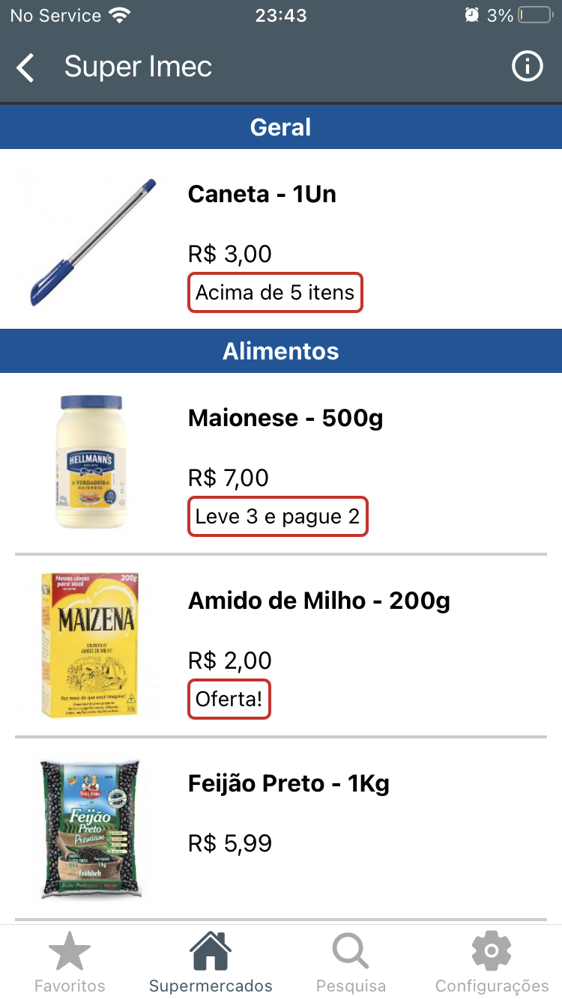
  &nbsp;&nbsp;&nbsp;&nbsp;
  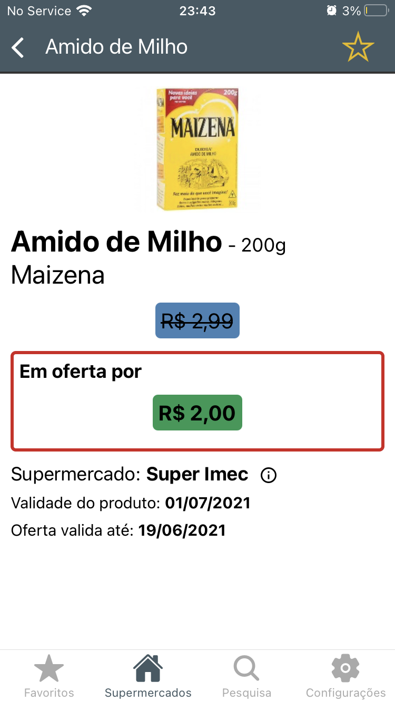
  &nbsp;&nbsp;&nbsp;&nbsp;
  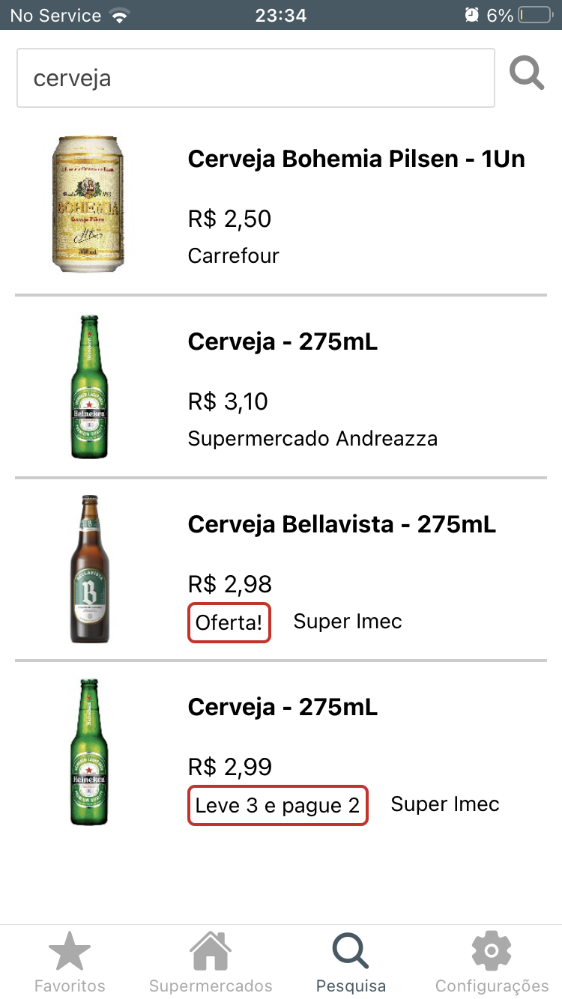

 

<h3 align="center">Mercados</h3>
 

  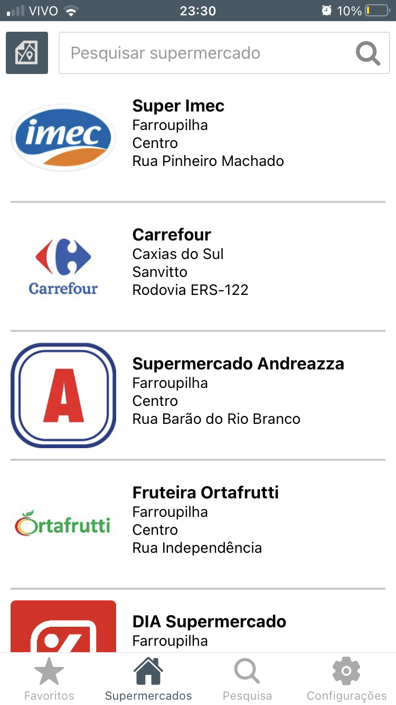
  &nbsp;&nbsp;&nbsp;&nbsp;
  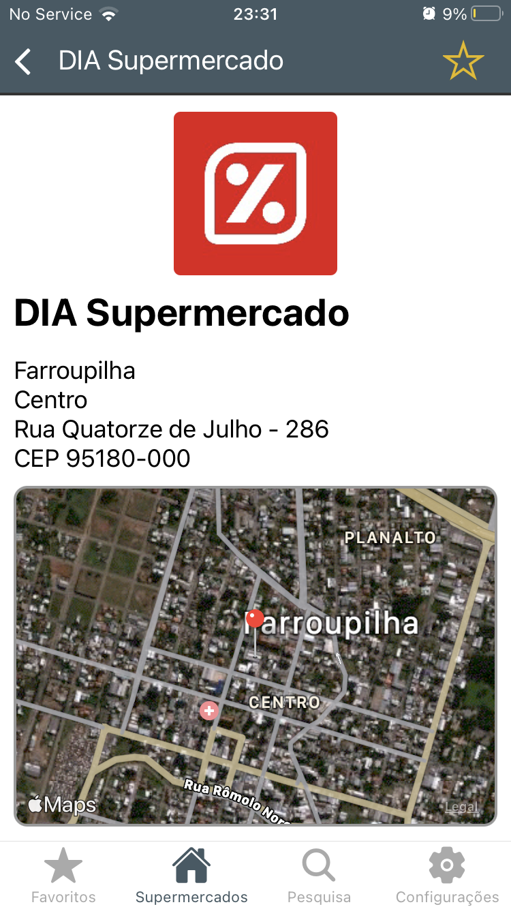
  &nbsp;&nbsp;&nbsp;&nbsp;
  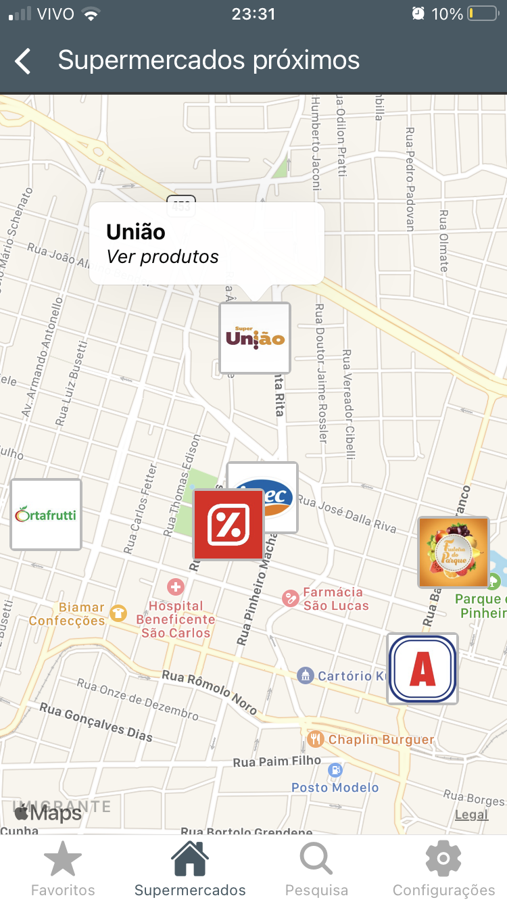

 

<h3 align="center">Favoritos</h3>
 

  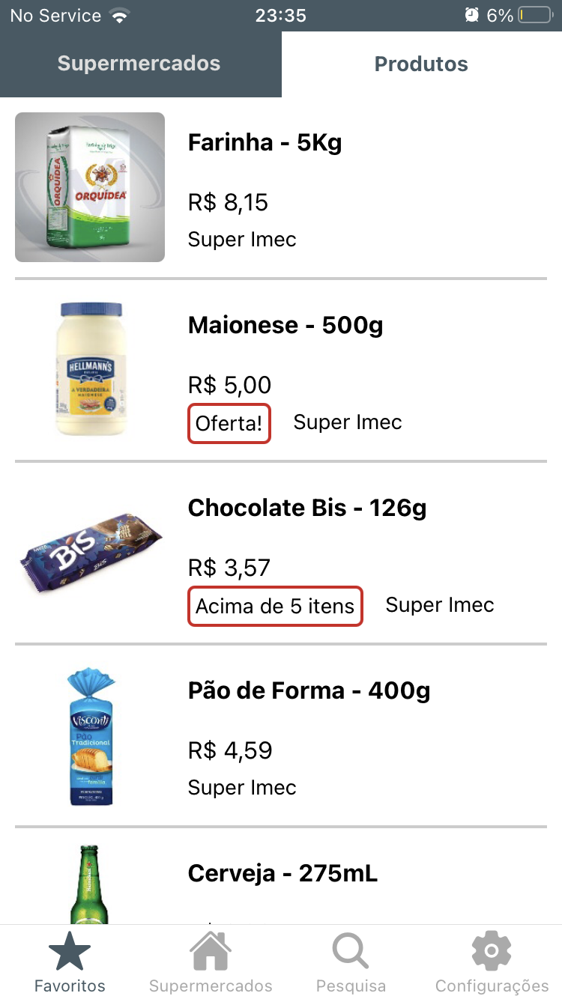
  &nbsp;&nbsp;&nbsp;&nbsp;
  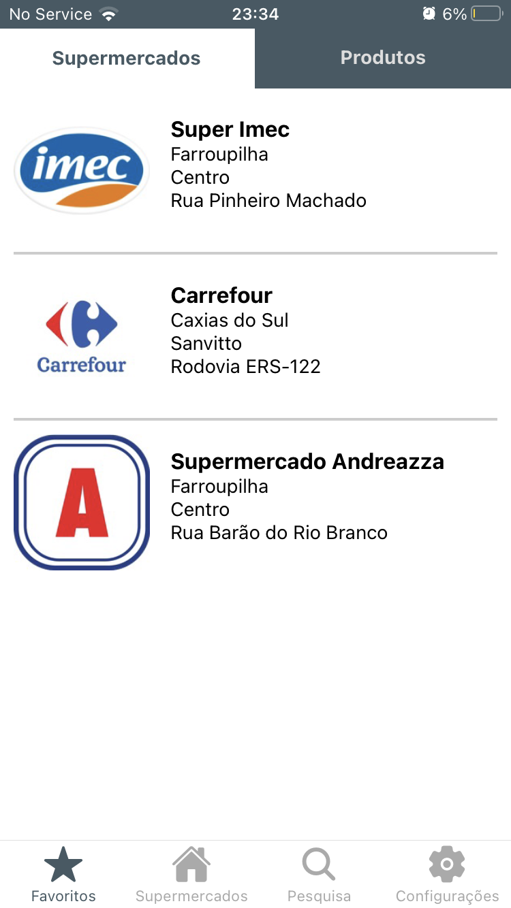

 

<h3 align="center">Login / Configurações</h3>
 

  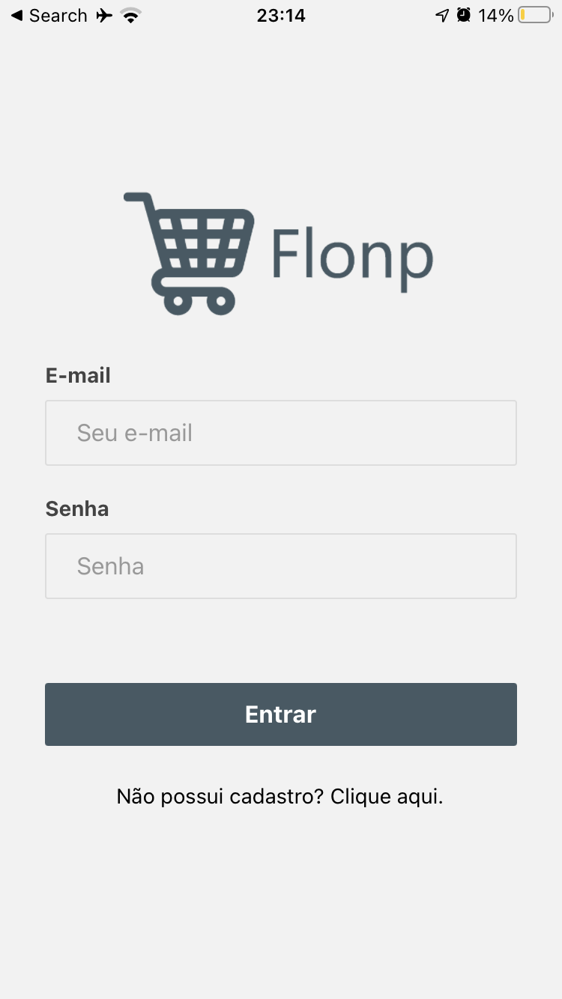
  &nbsp;&nbsp;&nbsp;&nbsp;
  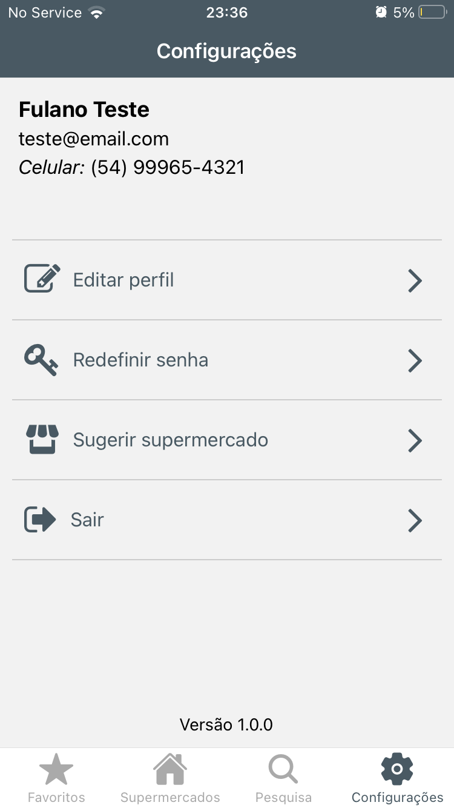

 

<h3 align="center">Notificações</h3>
 

  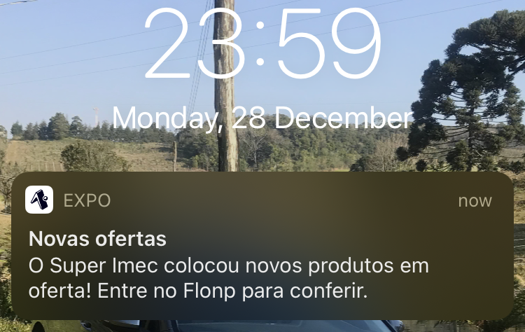

---

Feito com ♥ por Mugnol 👋 [Entre em contato!](https://www.linkedin.com/in/rafaelmugnol)

[vc]: https://code.visualstudio.com
[vceditconfig]: https://marketplace.visualstudio.com/items?itemName=EditorConfig.EditorConfig
[vceslint]: https://marketplace.visualstudio.com/items?itemName=dbaeumer.vscode-eslint

[c]:https://github.com/iuricode/README-template/blob/main/README-repository/iuricode.md?plain=1
[c]:https://blog.rocketseat.com.br/como-fazer-um-bom-readme/